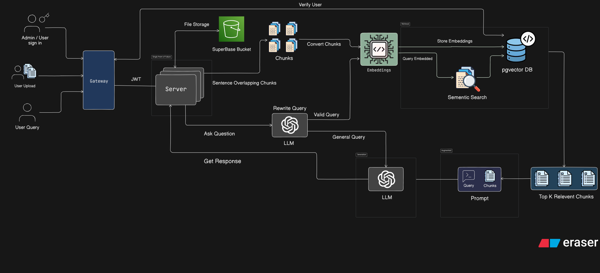
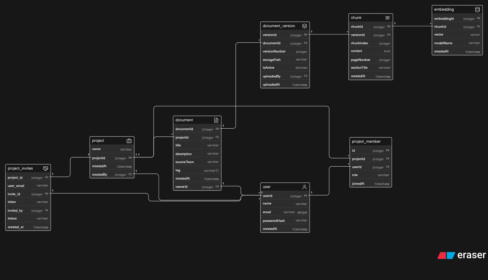

# 🧠 Cortex

**An Internal AI Knowledge & Decision System**

Cortex is a structured AI system designed to **ingest knowledge, retrieve relevant context, generate answers, and explain them with trust**.

It focuses on **clarity, reliability, and actionable intelligence**, not just raw AI responses.

---

# 🚀 What Cortex Does

* 📥 Ingests structured internal knowledge
* 🔍 Retrieves relevant information using embeddings
* 🧠 Generates answers using controlled reasoning
* 🔎 Explains *why* an answer was generated
* ⚙️ Maintains reliability through logging & system design

---

# 🏗️ System Architecture

## 🔹 System Design

## 🔹 ER Diagram

---

# 🧱 The 4 Core System Pillars

Cortex is built strictly on **four pillars**.
Everything in the system belongs to one of these.

---

## 1️⃣ Knowledge Ingestion

**Goal:** Bring clean, structured knowledge into the system.

### ✅ Includes

* Document upload (PDF, Markdown, Text)
* Versioning (v1, v2, v3…)
* Metadata (source, author, team, timestamp)
* Intelligent semantic chunking

### ❌ Excludes

* OCR / image parsing
* Web scraping
* Real-time collaboration

📌 **Rule:**

> If knowledge is not ingested cleanly, AI quality does not matter.

---

## 2️⃣ AI Retrieval & Reasoning

**Goal:** Find the right information and generate accurate answers.

### ✅ Includes

* Embeddings & vector search
* Top-k retrieval with thresholds
* Context window management
* Handling empty / partial results

### ❌ Excludes

* Model training / fine-tuning
* Multi-agent systems

📌 **Rule:**

> Retrieval quality matters more than model size.

---

## 3️⃣ Explainability & Trust (Core Differentiator)

**Goal:** Make every AI answer understandable and reliable.

### ✅ Includes

* Source attribution (docs + chunks)
* Confidence scoring
* Explanation of reasoning
* Clear uncertainty handling

### ❌ Excludes

* Complex academic XAI
* Heavy visualization tools

📌 **Rule:**

> An answer without explanation is a system failure.

---

## 4️⃣ Engineering & Ops

**Goal:** Ensure the system is stable, testable, and deployable.

### ✅ Includes

* API-first backend
* Basic authentication
* Logging (retrieval + generation)
* Monitoring & CI/CD
* Unit & integration tests

### ❌ Excludes

* Mobile apps
* Enterprise auth systems

📌 **Rule:**

> If it can’t be deployed or tested, it doesn’t exist.

---

# 🧩 Tech Stack

* **Frontend:** React
* **Backend:** Python (FastAPI)
* **Database:** PostgreSQL
* **Graph DB:** Neo4j
* **Queue:** Redis 
* **AI Layer:** Embeddings + LLM APIs

---

# 🎯 Vision

Cortex is not just an AI chatbot.
It is a **decision system** that transforms raw data into:

* structured knowledge
* explainable insights
* actionable outputs

---

# 📌 Final Note

Cortex is built with a clear philosophy:

> **Clarity > Complexity**
> **Trust > Raw AI Power**
> **Structure > Chaos**
