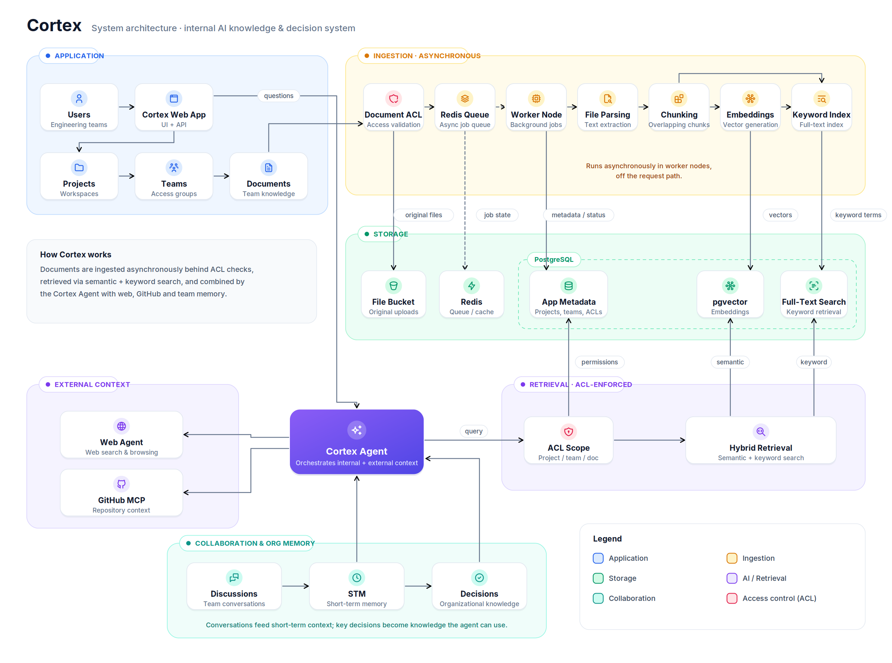
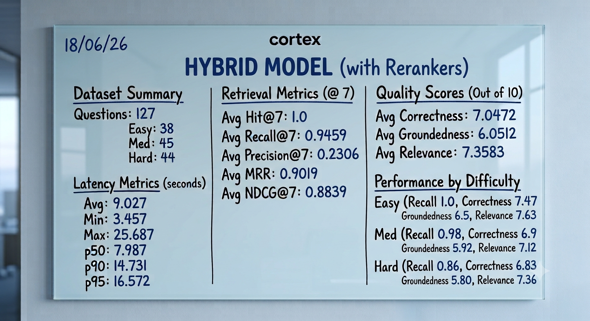

<h1>
  
  Cortex <small>— Internal AI Knowledge & Decision System</small>
</h1>

  Cortex is an internal AI system for organizing team knowledge, retrieving relevant context,
  generating grounded answers, and preserving decisions with source-aware AI.

---

## 🏗️ Architecture

  <strong>A system built around knowledge, retrieval, and intelligent decision support.</strong>

  Cortex connects secure document management, asynchronous ingestion,
  hybrid retrieval, AI generation, and team knowledge into one system.

 

  

 

  <a href="./architecture/Readme.md">
    <strong>Explore the detailed architecture →</strong>
  </a>

---

## 📊 Retrieval Evaluation

  <strong>Measuring retrieval quality, not just generation quality.</strong>

  Cortex was evaluated on a benchmark of <strong>125+ questions</strong>
  using retrieval metrics including Recall@7, MRR, and nDCG@7.

 

  

<strong>What was evaluated?</strong>

 

The evaluation compares retrieval approaches across:

- Semantic retrieval
- Keyword retrieval
- Hybrid retrieval with RRF
- Reranking

The final pipeline improved the measured retrieval metrics on the evaluation benchmark.

 

  <a href="./cortex-backend/rag/evaluation/readme.md">
    <strong>View the detailed evaluation →</strong>
  </a>

# 🧩 Tech Stack

| Layer | Technologies |
|---|---|
| **Frontend** | Next.js, React, TypeScript |
| **Backend** | Python, FastAPI |
| **Database** | PostgreSQL, pgvector |
| **Storage** | Supabase Storage |
| **Queue & Workers** | Redis, BullMQ |
| **AI / LLM** | Fireworks APIs |
| **AI Frameworks** | LangChain, LangGraph |
| **Search** | pgvector semantic search, PostgreSQL full-text search |
| **Infrastructure** | Docker, Vercel, Render |
| **Development** | Git, GitHub |

---

  Built as a system-first approach to internal AI knowledge and decision management.

