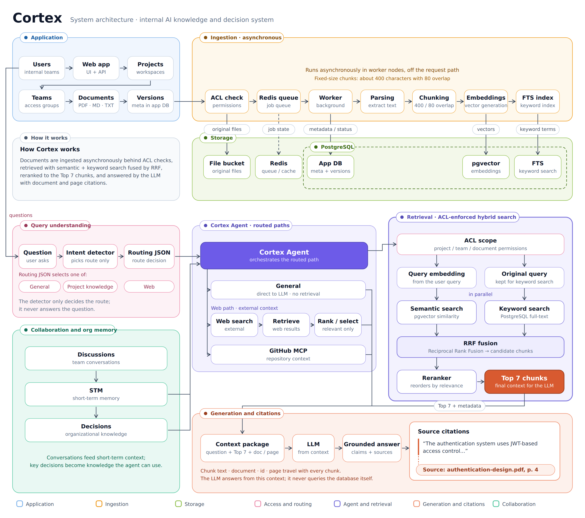

# Cortex Architecture

Cortex is structured around several core modules that work together to provide secure knowledge management, AI-powered retrieval, and team collaboration.

## Core Modules

- **Project & Team Management** — Organizes knowledge and collaboration around projects and teams.
- **Document Management** — Handles document upload, versioning, metadata, access control, and lifecycle management.
- **Document Ingestion** — Processes uploaded files asynchronously through queues and worker nodes.
- **Hybrid Retrieval** — Combines semantic search and keyword search using vector and PostgreSQL-based retrieval.
- **RAG Pipeline** — Uses RRF fusion, reranking, and the most relevant chunks to build context for the LLM.
- **Cortex Agent** — Combines project knowledge retrieval with external tools such as web search and GitHub MCP.
- **Short-Term Memory** — Maintains conversational and working context for agent interactions.
- **Discussions & Decisions** — Captures team discussions and preserves important decisions as organizational knowledge.
- **Citation & Source Tracking** — Grounds AI responses in retrieved documents and provides document/page-level sources.
- **Audit & Activity** — Tracks important system and user activities for visibility and accountability.
- **Analytics & Usage** — Tracks system activity, storage, AI usage, and team/project metrics.