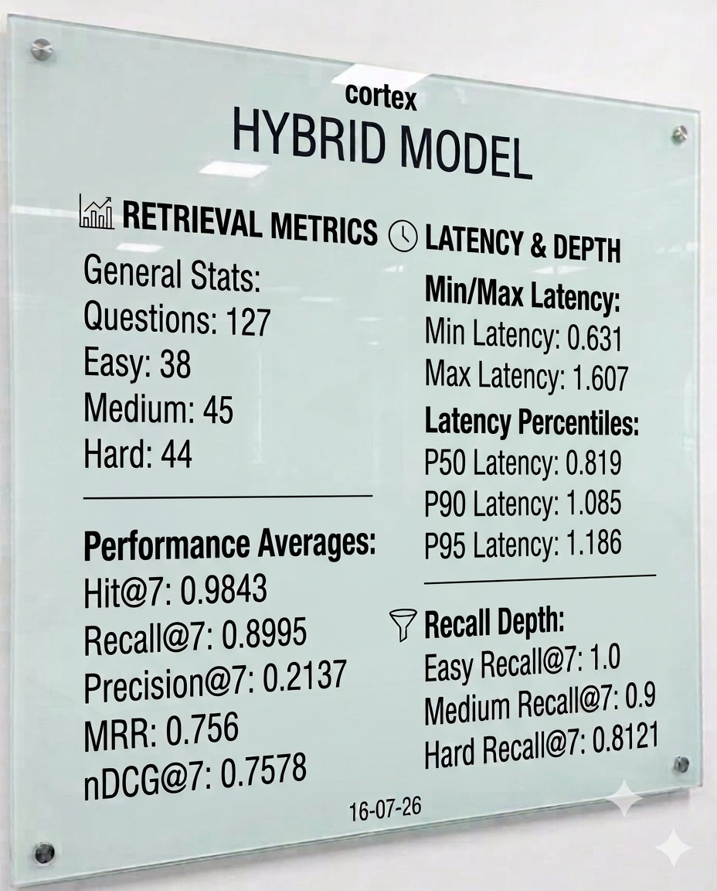
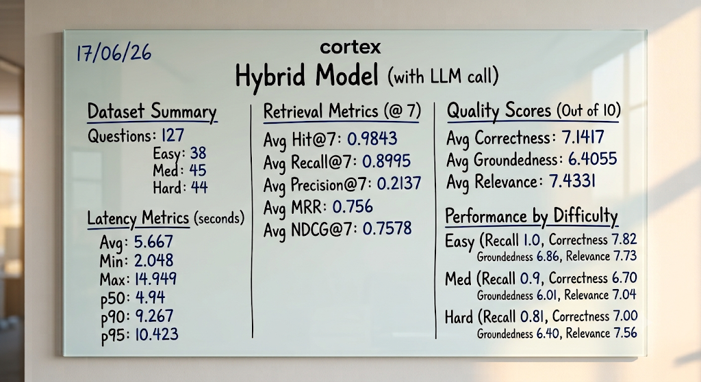

<h1>
  
  Cortex Hybrid Retrieval Evaluation
</h1>

The Cortex Hybrid Retrieval pipeline was evaluated on a **127-question benchmark dataset** containing **Easy (38)**, **Medium (45)**, and **Hard (44)** questions. The evaluation measures both **retrieval performance** and **answer quality** using an LLM-based judge.

---

##  Hybrid Retrieval Evaluation

The baseline evaluation measures how effectively the hybrid search pipeline retrieves the relevant document chunks before answer generation.

 

  

 

> **Observation:** The hybrid retrieval achieves high recall and ranking quality, making it a strong retrieval baseline.

---

##  Hybrid Retrieval + LLM Evaluation

This evaluation extends the retrieval benchmark by generating answers with the LLM and scoring their quality using an automated LLM judge.

  

> **Observation:** The LLM-based evaluation complements retrieval metrics by measuring answer **Correctness**, **Groundedness**, and **Relevance**.
---

## 📈 Evaluation Metrics

| Metric | Description |
|---------|-------------|
| **Hit@7** | Whether at least one relevant chunk appears in the top-7 retrieved results. |
| **Recall@7** | Fraction of expected chunks successfully retrieved within the top-7. |
| **Precision@7** | Fraction of retrieved chunks that are actually relevant. |
| **MRR** | Measures how early the first relevant chunk appears in the ranking. |
| **nDCG@7** | Evaluates the overall ranking quality of the retrieved chunks. |
| **Latency** | Time taken to complete the retrieval (or retrieval + generation) pipeline. |
| **Correctness** | Measures how accurately the generated answer matches the expected answer. |
| **Groundedness** | Measures whether the generated answer is fully supported by the retrieved context without hallucinations. |
| **Relevance** | Measures how well the answer stays focused on the user's question without unnecessary information. |
