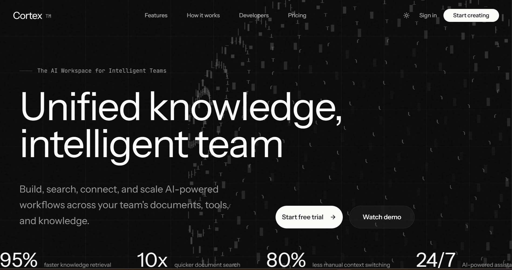
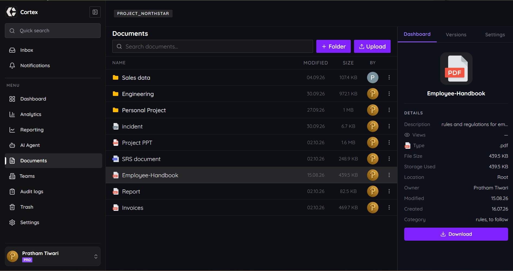
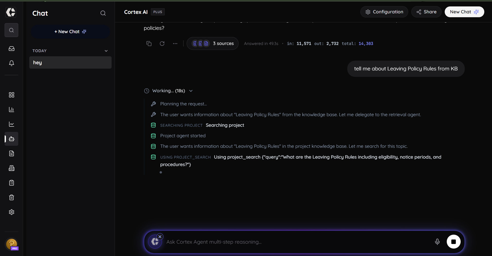
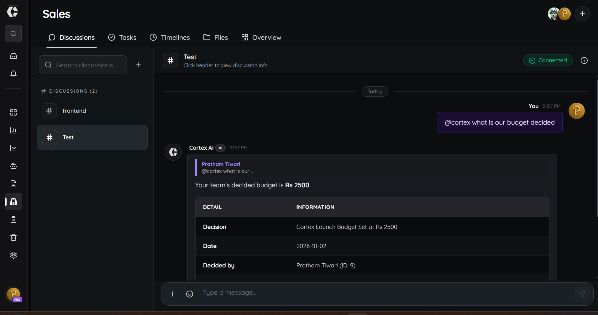
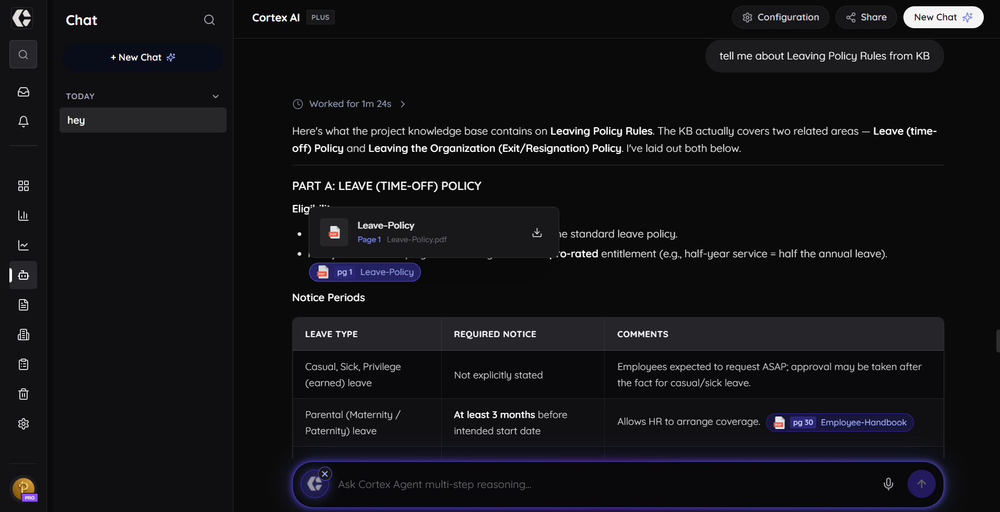
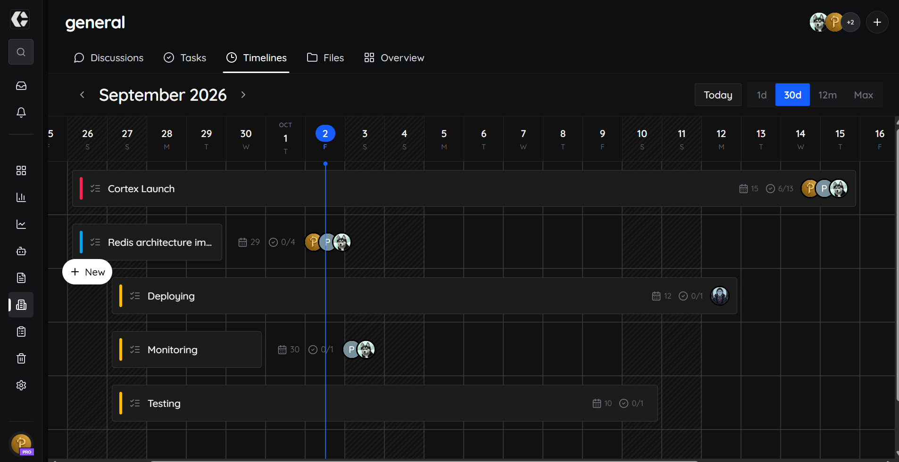
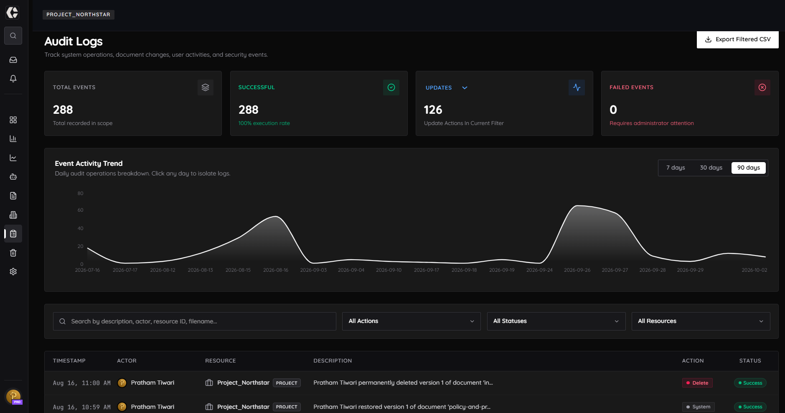

<h1>
  
  Cortex Demo
</h1>

A quick look at the Cortex interface and core workflows.

### Landing Page

### Documents

Document management, project knowledge, and document organization.

### Agent Thinking Process

Cortex Agent's reasoning and tool execution flow.

### Decision Agent

AI-assisted decision capture and organizational knowledge.

### Document Citations

Cortex Agent answers grounded in project documents with source references.

### Task Management

Task timeline and team activity management.

### Audit Logging

Track important system and user activities through an audit trail.

